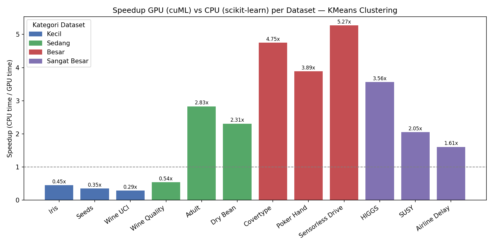
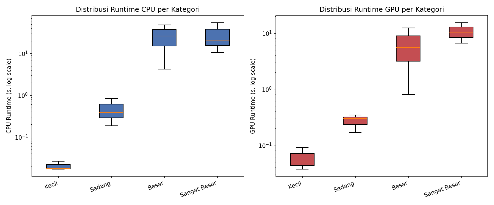

<div align="center">

# ⚡ CPU vs GPU Performance Analysis on KMeans Clustering

### A Statistically-Driven Benchmark of Classical ML Acceleration on GPU


-26.02-76B900?logo=nvidia&logoColor=white)


**12 datasets · 240 experiment runs · 1 hypothesis test per dataset · 1 clear engineering takeaway**

[Results Summary](#-results-summary) · [Key Findings](#-key-findings) · [Methodology](#-methodology) · [Repository Structure](#-repository-structure)

</div>

---

## 📑 Table of Contents

- Executive Summary
- Research Background
- Research Problem
- Methodology
- Results
- Statistical Analysis
- Key Findings

---

## 📌 Executive Summary

This project benchmarks **KMeans clustering** on **CPU (scikit-learn)** against **GPU (cuML/RAPIDS)** across **12 real-world datasets** spanning four size tiers — from 150 rows (Iris) to 1,000,000 rows (HIGGS, SUSY). Each dataset was run **10 times per device** on an NVIDIA Tesla T4 GPU, with results validated using **Welch's t-Test** and dual clustering-quality metrics (Silhouette Score, Davies-Bouldin Index).

**Bottom line:** GPU acceleration is not universally faster — it depends heavily on data scale. On datasets below ~1,000 rows, CPU wins due to GPU initialization overhead. Past that threshold, GPU speedup climbs steadily, peaking at an average of **4.6x** on large-scale datasets, all differences statistically significant (p < 0.05).



---

## 📌 Research Background

Classical machine learning algorithms like KMeans are traditionally executed on CPU. With the rise of GPU-accelerated libraries such as **RAPIDS cuML**, the same scikit-learn-style API can now run on GPU hardware — promising major speedups for data-intensive workloads. However, GPU acceleration comes with real costs: memory transfer overhead, CUDA kernel launch latency, and JIT compilation on first run. Whether GPU acceleration is *actually* worth it depends on data volume, and that trade-off point is rarely quantified rigorously — most comparisons rely on anecdotal "GPU is faster" claims rather than controlled, repeated, statistically validated experiments.

## 📌 Research Problem

> At what data scale does GPU-accelerated KMeans clustering become measurably and statistically faster than CPU-based KMeans — and is that acceleration achieved without sacrificing clustering quality?

## 📌 Research Objectives

1. Quantify the runtime difference between CPU (scikit-learn) and GPU (cuML) KMeans across datasets of increasing size.
2. Determine whether observed runtime differences are statistically significant, not just numerically different.
3. Evaluate whether GPU-accelerated clustering preserves clustering quality (Silhouette Score, Davies-Bouldin Index) relative to CPU.
4. Derive a practical size-based recommendation for when to use GPU vs CPU for KMeans workloads.

## 📌 Research Questions

- **RQ1:** How does KMeans runtime on CPU compare to GPU across datasets ranging from hundreds to a million rows?
- **RQ2:** Is the runtime difference between CPU and GPU statistically significant for each dataset?
- **RQ3:** Does GPU acceleration affect clustering quality (Silhouette Score, DBI) compared to CPU?
- **RQ4:** Is there an identifiable data-size threshold beyond which GPU consistently outperforms CPU?

## 📌 Research Hypothesis

- **H₀ (Null Hypothesis):** There is no significant difference between mean CPU and GPU runtime for KMeans clustering → μ_CPU = μ_GPU
- **H₁ (Alternative Hypothesis):** There is a significant difference between mean CPU and GPU runtime for KMeans clustering → μ_CPU ≠ μ_GPU
- **Significance level (α):** 0.05
- **Test used:** Independent **Welch's t-Test** (`equal_var=False`), since CPU and GPU runtime variances are not assumed equal. H₀ is rejected if p-value < α.

---

## 📌 Skills Demonstrated

| Category | Skills |
|---|---|
| **Machine Learning** | Unsupervised learning (KMeans), cluster evaluation metrics, GPU-accelerated ML with cuML/RAPIDS |
| **Statistical Analysis** | Hypothesis formulation, Welch's t-Test, interpreting p-values and significance |
| **Experimental Design** | Controlled repeated-trial benchmarking (N=10 runs), GPU warm-up handling, fair CPU/GPU comparison design |
| **Data Engineering** | Multi-source data ingestion (UCI, sklearn, Kaggle), preprocessing pipelines, feature scaling |
| **Data Visualization** | Comparative bar charts, boxplots, log-scale runtime distributions with matplotlib |
| **Scientific Communication** | Structuring findings into reproducible, evidence-backed conclusions and recommendations |
| **Tools & Environment** | Google Colab GPU runtime, CUDA/cuML dependency management, Git/GitHub project structuring |

---

## 📌 Experimental Setup

| | |
|---|---|
| **Platform** | Google Colab (GPU runtime) |
| **GPU** | NVIDIA Tesla T4 — 15,360 MiB VRAM |
| **Driver / CUDA** | 580.82.07 / CUDA 13.0 |
| **CPU Library** | scikit-learn 1.6.1 (`KMeans`) |
| **GPU Library** | cuML (RAPIDS) 26.02.000 (`cuKMeans`) |
| **Supporting Libraries** | NumPy 2.0.2, Pandas 2.2.2, SciPy 1.16.3 |
| **Runs per dataset per device** | 10 |
| **Timing method** | `time.perf_counter()`, with `cp.cuda.Stream.null.synchronize()` before stopping the GPU timer (CUDA ops are asynchronous — without sync, timers under-report true GPU runtime) |


---

## 📌 Dataset Information

12 datasets across 4 size tiers, sourced from UCI Machine Learning Repository, scikit-learn's built-in loaders, and Kaggle.

| Category | Dataset | Rows | Features | Clusters (k) | Source |
|---|---|---:|---:|---:|---|
| Small | Iris | 150 | 4 | 3 | [UCI](https://archive.ics.uci.edu/dataset/53/iris) |
| Small | Seeds | 210 | 7 | 3 | [UCI](https://archive.ics.uci.edu/dataset/236/seeds) |
| Small | Wine (UCI) | 178 | 13 | 3 | [UCI](https://archive.ics.uci.edu/dataset/109/wine) |
| Medium | Wine Quality | 5,318* | 11 | 3 | [UCI](https://archive.ics.uci.edu/dataset/186/wine+quality) |
| Medium | Adult (Census Income) | 32,334* | 6 | 3 | [UCI](https://archive.ics.uci.edu/dataset/2/adult) |
| Medium | Dry Bean | 13,611 | 16 | 7 | [UCI](https://archive.ics.uci.edu/dataset/602/dry+bean+dataset) |
| Large | Covertype | 581,012 | 54 | 7 | [UCI](https://archive.ics.uci.edu/dataset/31/covertype) |
| Large | Poker Hand | 500,000* | 10 | 10 | [UCI](https://archive.ics.uci.edu/dataset/158/poker+hand) |
| Large | Sensorless Drive Diagnosis | 58,509 | 48 | 11 | [UCI](https://archive.ics.uci.edu/dataset/325/dataset+for+sensorless+drive+diagnosis) |
| Very Large | HIGGS | 1,000,000* | 28 | 7 | [UCI](https://archive.ics.uci.edu/dataset/280/higgs) |
| Very Large | SUSY | 1,000,000* | 18 | 5 | [UCI](https://archive.ics.uci.edu/dataset/279/susy) |
| Very Large | Airline Delay (2015) | 944,644* | 5 | 5 | [Kaggle](https://www.kaggle.com/datasets/usdot/flight-delays) |

<sup>*After deduplication/cleaning or intentional sampling to keep experiment runtime reasonable.</sup>

Full details (feature descriptions, cluster rationale) in [`docs/datasets.md`](docs/datasets.md). Dataset placement guide in [`data/README.md`](data/README.md).

---

## 📌 Methodology

Each dataset follows an identical, controlled pipeline to ensure a fair CPU vs GPU comparison:

1. **Load** — pull from original source (UCI, sklearn, or Kaggle).
2. **Preprocess** — check for missing values/duplicates, then standardize features with `StandardScaler`.
3. **GPU warm-up** — run cuML once before timing, to absorb CUDA JIT compilation cost.
4. **10x timed runs** — CPU and GPU KMeans executed on identical scaled data, `n_init=10` fixed for both.
5. **Metric computation** — average/std runtime, speedup ratio, Silhouette Score, Davies-Bouldin Index.
6. **Hypothesis testing** — Welch's t-Test between the 10 CPU runtimes and 10 GPU runtimes.
7. **Aggregation** — results compiled and visualized across all 12 datasets.


Full function-level methodology (including the exact `run_cpu` / `run_gpu` / `run_experiment` implementation) is documented in [`docs/methodology.md`](docs/methodology.md).

## 📌 Workflow


---

## 📌 Results Summary

| Category | Datasets | Avg. Rows | Avg. Speedup | Min | Max |
|---|---:|---:|---:|---:|---:|
| Small | 3 | 179 | **0.36x** | 0.29x | 0.45x |
| Medium | 3 | 17,088 | **1.89x** | 0.54x | 2.83x |
| Large | 3 | 379,840 | **4.64x** | 3.89x | 5.27x |
| Very Large | 3 | 981,548 | **2.41x** | 1.61x | 3.56x |

*(Speedup = CPU avg. runtime ÷ GPU avg. runtime; > 1x means GPU is faster.)*

<details>
<summary><b>Full per-dataset results (click to expand)</b></summary>

| Dataset | Category | Rows | CPU Avg (s) | GPU Avg (s) | Speedup | Silhouette | DBI |
|---|---|---:|---:|---:|---:|---:|---:|
| Iris | Small | 150 | 0.0170 | 0.0375 | 0.45x | 0.460 | 0.834 |
| Seeds | Small | 210 | 0.0176 | 0.0501 | 0.35x | 0.401 | 0.928 |
| Wine UCI | Small | 178 | 0.0263 | 0.0911 | 0.29x | 0.285 | 1.389 |
| Wine Quality | Medium | 5,318 | 0.1871 | 0.3444 | 0.54x | 0.230 | 1.507 |
| Adult | Medium | 32,334 | 0.8421 | 0.2974 | 2.83x | 0.193 | 1.566 |
| Dry Bean | Medium | 13,611 | 0.3910 | 0.1692 | 2.31x | 0.310 | 1.099 |
| Covertype | Large | 581,012 | 26.237 | 5.523 | 4.75x | 0.089 | 1.960 |
| Poker Hand | Large | 500,000 | 48.631 | 12.506 | 3.89x | 0.065 | 2.208 |
| Sensorless Drive | Large | 58,509 | 4.248 | 0.806 | 5.27x | 0.173 | 1.426 |
| HIGGS | Very Large | 1,000,000 | 55.068 | 15.453 | 3.56x | 0.038 | 2.859 |
| SUSY | Very Large | 1,000,000 | 20.887 | 10.179 | 2.05x | 0.106 | 2.176 |
| Airline Delay | Very Large | 944,644 | 10.664 | 6.630 | 1.61x | 0.456 | 0.746 |

Raw data: [`results/experiment_results.csv`](results/experiment_results.csv)

</details>



---

## 📌 Statistical Analysis

Welch's t-Test (α = 0.05) was applied to the 10 CPU vs 10 GPU runtimes for every dataset:

| Dataset | t-statistic | p-value | Reject H₀? |
|---|---:|---:|:---:|
| Iris | -6.906 | 6.49e-06 | ✅ Yes |
| Seeds | -3.246 | 9.36e-03 | ✅ Yes |
| Wine UCI | -5.962 | 1.95e-04 | ✅ Yes |
| Wine Quality | -3.060 | 1.02e-02 | ✅ Yes |
| Adult | 5.989 | 5.15e-05 | ✅ Yes |
| Dry Bean | 33.559 | 8.99e-16 | ✅ Yes |
| Covertype | 26.049 | 7.45e-10 | ✅ Yes |
| Poker Hand | 118.879 | 1.05e-15 | ✅ Yes |
| Sensorless Drive | 26.014 | 8.56e-10 | ✅ Yes |
| HIGGS | 37.452 | 3.38e-11 | ✅ Yes |
| SUSY | 51.071 | 2.07e-12 | ✅ Yes |
| Airline Delay | 14.177 | 1.83e-07 | ✅ Yes |

**All 12 datasets reject H₀** (p < 0.05) — every observed CPU/GPU runtime difference is statistically significant, not due to random variation. Full results: [`results/ttest_results.csv`](results/ttest_results.csv).

---

## 📌 Key Findings

1. **GPU is not universally faster.** On datasets under ~1,000 rows (Iris, Seeds, Wine UCI), CPU outperforms GPU — initialization and memory-transfer overhead dominate at small scale.
2. **Speedup grows with data volume**, peaking at the **Large** tier (avg. **4.64x**), before slightly tapering at **Very Large** scale (avg. 2.41x) — likely influenced by feature dimensionality and per-dataset characteristics rather than row count alone.
3. **Every runtime difference is statistically significant** (p < 0.05 across all 12 datasets) — the CPU/GPU performance gap is not noise.
4. **Clustering quality is preserved.** Silhouette Score and Davies-Bouldin Index trends are consistent between the CPU and GPU implementations — acceleration does not come at the cost of accuracy.
5. **Practical recommendation:** use CPU for datasets under ~1,000 rows; switch to GPU for datasets beyond ~50,000–100,000 rows for consistent, meaningful speedup.

**Limitations:** experiments were run on a single GPU model (Tesla T4); HIGGS, SUSY, and Airline Delay each use a 1M-row subsample rather than the full dataset; no hyperparameter tuning (e.g. Elbow Method) was performed to select an optimal *k* — cluster counts followed each dataset's known class structure.

---

## 📌 Technologies Used


- **scikit-learn** — CPU-based KMeans, StandardScaler, Silhouette Score, Davies-Bouldin Index
- **cuML (RAPIDS)** — GPU-accelerated KMeans (`cuKMeans`) with CuPy array backend
- **SciPy** — Welch's t-Test (`scipy.stats.ttest_ind`)
- **NumPy / Pandas** — numerical computation and data wrangling
- **Matplotlib** — comparative bar charts and boxplot visualizations
- **Google Colab** — free Tesla T4 GPU runtime for reproducible experimentation

---

## 📌 Repository Structure

```
cpu-vs-gpu-kmeans-performance-analysis/
│
├── data/
│   ├── small/                          # Iris, Seeds, Wine (UCI)
│   ├── medium/                         # Wine Quality, Adult, Dry Bean
│   ├── large/                          # Covertype, Poker Hand, Sensorless Drive
│   └── README.md
│
├── images/
│   ├── architecture.png                # CPU vs GPU execution path
│   ├── speedup-chart.png               # Speedup per dataset (real data)
│   ├── boxplot.png                     # Runtime distribution by category
│   ├── workflow.png                    # End-to-end experiment pipeline
│   └── hardware.png                    # Hardware/software spec card
│
├── results/
│   ├── experiment_results.csv          # Full per-dataset metrics
│   ├── summary_statistics.csv          # Aggregated by size category
│   └── ttest_results.csv               # Welch's t-Test results
│
├── docs/
│   ├── methodology.md                  # Full experimental methodology
│   └── datasets.md                     # Detailed dataset documentation
│
|── notebooks/
|   ├── CPU_vs_GPU_KMeans_Experiment.ipynb  # Original source notebook
|
|── presentation/
|    ├── CPU_vs_GPU_KMeans.pptx  # Original source presentation
|
├── README.md
├── LICENSE
└── .gitignore
```
---

## 🚀 Future Work

Potential future improvements include:

- Additional clustering algorithms (DBSCAN, Hierarchical Clustering)
- Multiple GPU benchmarking
- Memory usage analysis
- Energy efficiency comparison
- Hyperparameter optimization

---

## 📚 References

- scikit-learn Documentation
- RAPIDS cuML Documentation
- UCI Machine Learning Repository
- Kaggle Dataset Repository

---

## 📌 Author

**Pandu Kukuh Waskito Wibowo**
Informatics Engineering Student — Data Science, AI & Machine Learning
Universitas Widyatama

<sub>This project was completed as part of a Machine Learning coursework assignment (Tugas Besar), focused on hands-on benchmarking of GPU-accelerated clustering using cuML/RAPIDS.</sub>

[LinkedIn](https://linkedin.com/in/pandu-wibowo)
[GitHub](https://github.com/panduwibowo-eng)
[Email](pandu.k.wibowo@gmail.com)

