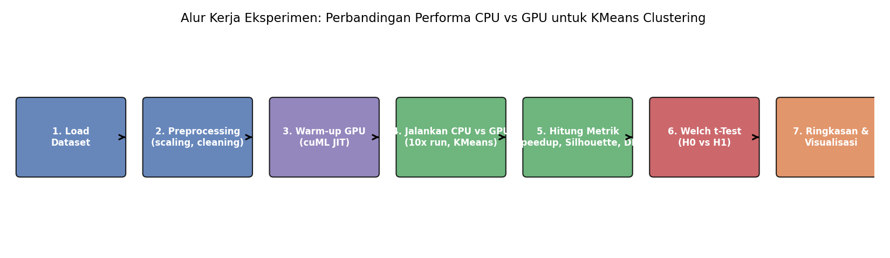
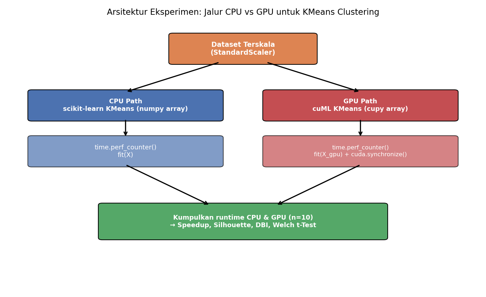
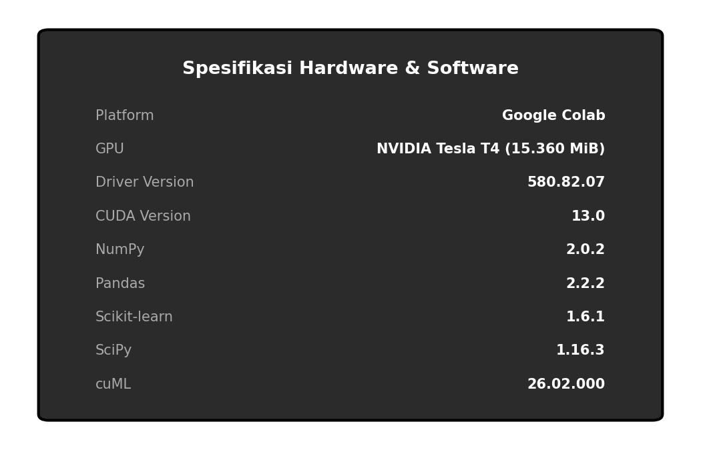

# Metodologi Eksperimen

## 1. Tujuan

Membandingkan performa runtime algoritma **KMeans Clustering** ketika dijalankan pada **CPU** (`scikit-learn`) versus **GPU** (`cuML`/RAPIDS), pada dataset dengan berbagai ukuran, untuk mengetahui pada titik ukuran data mana akselerasi GPU mulai memberikan keuntungan signifikan.

## 2. Hipotesis Penelitian

- **H₀ (Hipotesis Nol):** Tidak ada perbedaan signifikan antara rata-rata runtime KMeans pada CPU dan GPU → μ_CPU = μ_GPU
- **H₁ (Hipotesis Alternatif):** Terdapat perbedaan signifikan antara rata-rata runtime KMeans pada CPU dan GPU → μ_CPU ≠ μ_GPU
- **Tingkat signifikansi (α):** 0.05

Uji yang digunakan: **Independent Welch's t-Test** (`equal_var=False`), karena variansi runtime CPU dan GPU tidak diasumsikan sama. Keputusan: tolak H₀ jika **p-value < α**.

## 3. Desain Eksperimen

Setiap dataset diproses melalui tahapan berikut:



1. **Load dataset** dari sumber aslinya (UCI Repository, scikit-learn built-in, atau Kaggle).
2. **Preprocessing**: pengecekan missing value dan duplikat, lalu standardisasi fitur numerik dengan `StandardScaler`.
3. **GPU warm-up**: menjalankan satu kali `run_gpu()` sebelum pengukuran, karena cuML melakukan JIT compilation CUDA pada eksekusi pertama — tanpa warm-up, waktu run pertama akan bias.
4. **10 kali percobaan (N_RUNS = 10)** KMeans dijalankan berturut-turut di CPU dan di GPU pada data yang identik.
5. **Perhitungan metrik**: rata-rata dan standar deviasi runtime, speedup ratio, Silhouette Score, Davies-Bouldin Index (DBI).
6. **Welch's t-Test** antara kumpulan runtime CPU dan GPU.
7. **Ringkasan dan visualisasi** lintas seluruh dataset.

## 4. Arsitektur Pengukuran Waktu



Fungsi inti eksperimen (disederhanakan dari notebook):

```python
N_RUNS = 10          # jumlah percobaan per eksperimen
ALPHA  = 0.05        # tingkat signifikansi uji hipotesis

def run_cpu(X, n_clusters=3, n_init=10, random_state=42):
    """Jalankan KMeans di CPU, kembalikan (runtime_detik, labels)."""
    model = KMeans(n_clusters=n_clusters, random_state=random_state, n_init=n_init)
    start = time.perf_counter()
    model.fit(X)
    elapsed = time.perf_counter() - start
    return elapsed, model.labels_

def run_gpu(X_gpu, n_clusters=3, n_init=10, random_state=42):
    """Jalankan KMeans di GPU, kembalikan (runtime_detik, labels).
    Sinkronisasi CUDA dilakukan sebelum mencatat waktu akhir."""
    model = cuKMeans(n_clusters=n_clusters, random_state=random_state, n_init=n_init)
    start = time.perf_counter()
    model.fit(X_gpu)
    cp.cuda.Stream.null.synchronize()   # tunggu GPU benar-benar selesai
    elapsed = time.perf_counter() - start
    return elapsed, model.labels_.get()

def gpu_warmup(X_gpu, n_clusters=3):
    """GPU warm-up: run sekali untuk inisialisasi JIT CUDA."""
    run_gpu(X_gpu, n_clusters=n_clusters)

def run_experiment(X_cpu, X_gpu, n_clusters, label=''):
    """Jalankan N_RUNS kali eksperimen CPU dan GPU, kembalikan semua metrik."""
    gpu_warmup(X_gpu, n_clusters=n_clusters)

    cpu_times, gpu_times = [], []
    for i in range(N_RUNS):
        t_cpu, _ = run_cpu(X_cpu, n_clusters=n_clusters)
        t_gpu, _ = run_gpu(X_gpu, n_clusters=n_clusters)
        cpu_times.append(t_cpu)
        gpu_times.append(t_gpu)

    _, labels_cpu = run_cpu(X_cpu, n_clusters=n_clusters)
    sil = silhouette_score(X_cpu, labels_cpu, sample_size=min(5000, len(X_cpu)), random_state=42)
    dbi = davies_bouldin_score(X_cpu, labels_cpu)

    avg_cpu, avg_gpu = np.mean(cpu_times), np.mean(gpu_times)
    speedup = avg_cpu / avg_gpu
    t_stat, p_val = ttest_ind(cpu_times, gpu_times, equal_var=False)

    return {
        'avg_cpu': avg_cpu, 'avg_gpu': avg_gpu, 'speedup': speedup,
        'silhouette': sil, 'dbi': dbi, 't_stat': t_stat, 'p_value': p_val, 'label': label,
    }
```

**Catatan penting terkait pengukuran waktu GPU:**
- `n_init=10` diset sama di CPU dan GPU agar perbandingan adil.
- `cp.cuda.Stream.null.synchronize()` dipanggil sebelum mencatat waktu akhir GPU, karena operasi CUDA bersifat *asynchronous* — tanpa sinkronisasi, timer bisa berhenti sebelum GPU benar-benar selesai memproses, sehingga runtime GPU akan tampak lebih cepat dari yang sebenarnya.

## 5. Metrik Evaluasi

| Metrik | Definisi |
|---|---|
| **Runtime (avg ± std)** | Rata-rata dan standar deviasi waktu eksekusi `fit()` dari 10 kali run |
| **Speedup Ratio** | `avg_cpu / avg_gpu` — nilai > 1 berarti GPU lebih cepat |
| **Silhouette Score** | Mengukur seberapa baik separasi antar cluster (semakin tinggi semakin baik) |
| **Davies-Bouldin Index (DBI)** | Mengukur rasio sebaran dalam-cluster terhadap jarak antar-cluster (semakin rendah semakin baik) |
| **t-statistic & p-value** | Hasil Welch's t-Test antara runtime CPU dan GPU |

## 6. Hardware & Software



## 7. Kesimpulan Umum

1. **GPU tidak selalu lebih cepat** — pada dataset kecil (< 1.000 baris), overhead inisialisasi GPU (memory transfer, kernel launch) membuat CPU lebih efisien.
2. **Perbedaan runtime signifikan secara statistik** (tolak H₀) hampir di seluruh dataset, menandakan akselerasi/perlambatan GPU bukan kebetulan.
3. **Kualitas clustering konsisten** antara CPU dan GPU — akselerasi tidak mengorbankan akurasi hasil clustering.
4. **Rekomendasi praktis:**
   - Dataset kecil (< 1.000 baris): CPU sudah memadai.
   - Dataset besar (> 100.000 baris): GPU memberikan keuntungan performa yang jelas.

Detail hasil per dataset tersedia di [`../results/`](../results/).
